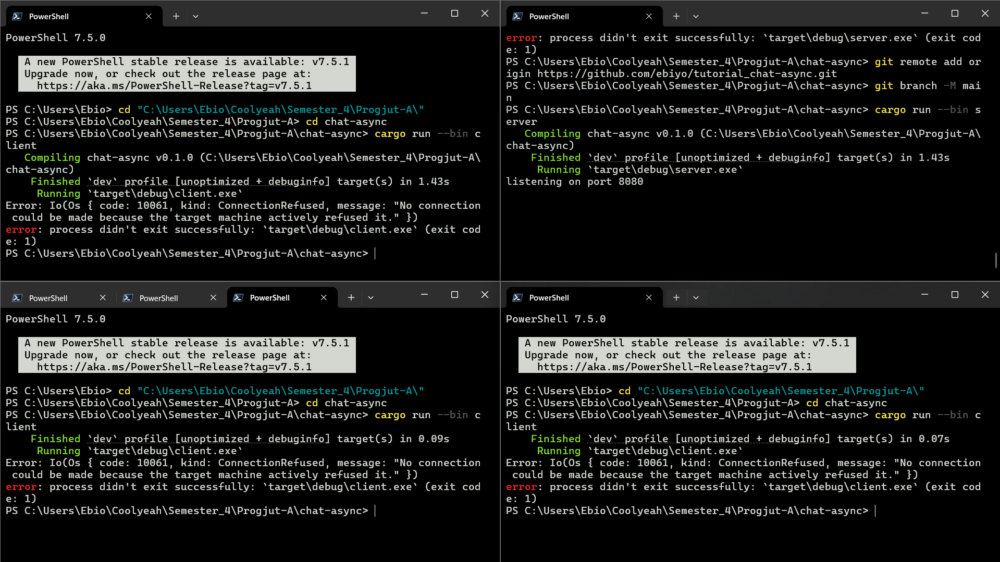

Setelah run server dan ketiga client, client pun mengalami error ```"No connection could be made because the target machine actively refused it."```. Hal ini disebabkan karena client mendengarkan port 2000 namun server membroadcast ke port 8080.