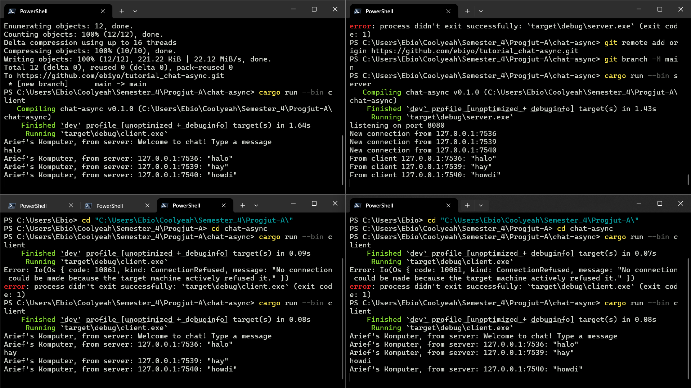
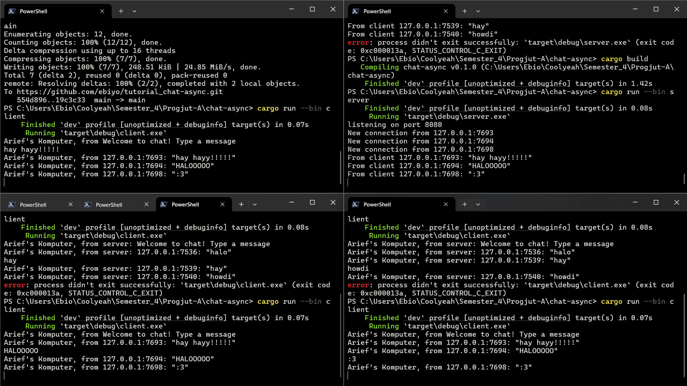

Nama: Arief Ridzki Darmawan
NPM: 2306210115
Kelas: A

# 2.1

Setelah run server dan ketiga client, client pun mengalami error ```"No connection could be made because the target machine actively refused it."```. Hal ini disebabkan karena client mendengarkan port 2000 namun server membroadcast ke port 8080.

(Saya sudah mengubah port pada server.rs menjadi 8080 karena sebelumnya mendapatkan error ```"An attempt was made to access a socket in a way forbidden by its access permissions."```)

# 2.2


Keduanya menggunakan protokol websocket yang sama dari ```tokio_websockets```.
Koneksi sisi client:
* ```ClientBuilder::from_uri(Uri::from_static("ws://127.0.0.1:8080"))```

Koneksi sisi server:
* ```let (_req, ws_stream) = ServerBuilder::new().accept(socket).await?;```

Setelah mengubah port menjadi 8080 di server.rs dan client.rs, semuanya berhasil dijalankan karena server membroadcast ke port 8080 dan client juga mendengarkan ke port 8080.

Chat dari setiap client akan tampil pada semua client-client lain, dan juga pada server.

# 2.3

Saya telah memodifikasi teks agar terlihat lebih rapih dan memberi informasi dengan lebih jelas.